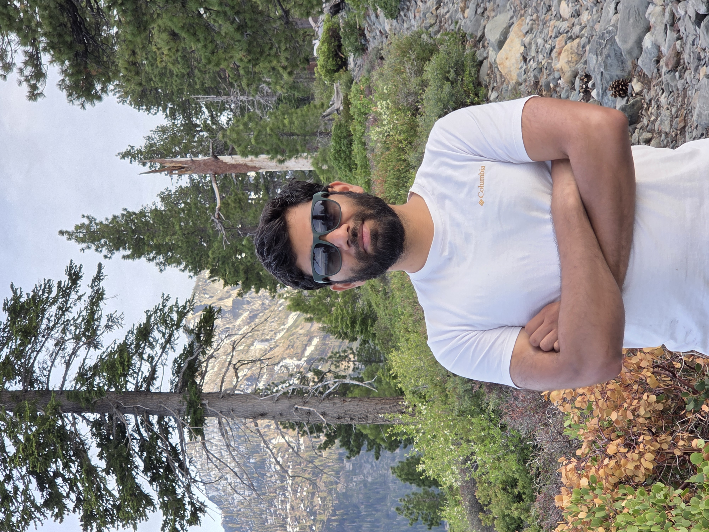

I develop AI-powered solutions for computer vision and medical imaging, specializing in explainable AI (XAI) and deep learning. My work focuses on building interpretable models for neuroimaging and healthcare applications.

---

## About Me

- 🎓 PhD Candidate, University of Southern California 
- 🧠 8+ years of research experience spanning deep learning, computer vision, and medical imaging
- 📄 First-author publications in PNAS, GeroScience and other leading venues
- ☁️ Experience building ML pipelines on AWS, Linux GPU clusters, and NVIDIA A100 hardware
- 🔬 Interested in Generative AI, Computer Vision, Foundation Models, Medical AI, and Scientific Machine Learning

---

# Featured Projects

## Local Brain Age Prediction

Improved upon a global brain age prediction model by developing a deep learning–based local brain age estimation framework that predicts regional biological brain age from structural MRI, offering more interpretable and sensitive assessment of localized brain aging.

**Highlights**

- Autoencoder models
- MRI preprocessing
- Explainable AI
- Large-scale GPU training

🔗 [Demo Link](https://localba-usc.streamlit.app/)

---
## Brain Age Estimation

Designed and released a **TensorFlow-based deep learning model** for global brain age prediction from structural MRI, emphasizing generalizability across datasets.

**Tech:** TensorFlow, Python, Medical Imaging, MRI, Deep Learning

🔗 [GitHub](https://github.com/irimia-laboratory/USC_BA_estimator/tree/v2)

---

## DICOM Anonymizer

Open-source software for configurable DICOM de-identification with multiple anonymization levels.

🔗 [GitHub Link](https://github.com/nikhilcusc/DICOMAnon)

---

# Research Experience

## Graduate Research Assistant
**Aging & Imaging Laboratory**
**University of Southern California**
2018 – Present

Working on deep learning methods for brain aging, neurodegeneration, and medical image analysis.

### Selected Contributions

- Developed deep learning models for biological brain age prediction using MRI
- Designed hybrid ControlNet + diffusion models for longitudinal MRI synthesis
- Evaluated explainability techniques including Integrated Gradients and SHAP for medical AI
- Built automated CT brain segmentation software for regional morphometry
- Developed diffusion MRI tractography pipelines
- Managed cloud-based neuroimaging workflows using AWS EC2 and S3
- Configured Linux GPU servers including NVIDIA A100 systems
- Built reproducible research pipelines using PyTorch and TensorFlow

---

# Technical Skills

### Machine Learning

- PyTorch
- TensorFlow
- CUDA
- Diffusion Models
- ControlNet
- Computer Vision
- Deep Learning
- Explainable AI

### Programming

- Python
- C++
- MATLAB
- Bash

### Infrastructure

- Linux
- AWS (EC2, S3)
- Git
- GitHub Actions
- GPU Computing

### Data

- NumPy
- pandas
- SQL
- Elasticsearch
- JSON

---

# Publications

- 20+ peer-reviewed publications
- First-author papers in PNAS, GeroScience.
- IEEE ISBI, ICASSP, OHBM, AAIC
## Selected Publications

1. **Deep learning maps local brain aging in relation to cognition across human adulthood**  
   *Proceedings of the National Academy of Sciences (PNAS), 2026* [Paper 🔗](https://www.pnas.org/doi/10.1073/pnas.2532233123)

1. **Interpretable Deep Learning Reveals Spatiotemporal MRI Features of Brain Aging That Align with Neurodegeneration**  
*GeroScience, 2026*  [Paper 🔗](https://doi.org/10.1007/s11357-026-02112-2)

1. **Anatomic Interpretability in Neuroimage Deep Learning: Saliency Approaches for Typical Aging and Traumatic Brain Injury**  
   *Neuroinformatics, 2024*  [Paper 🔗](https://doi.org/10.1007/s12021-024-09694-2)

1. **Controllable Generative Model for Brain Evolution** (*Equal Contribution*)  
   *ICASSP 2025 – IEEE International Conference on Acoustics, Speech and Signal Processing*
   [Paper 🔗](https://doi.org/10.1109/ICASSP49660.2025.10888742)

📚 **View all publications:** [Google Scholar](https://scholar.google.com/citations?user=0HvizQ0AAAAJ&hl=en)

**Visit my ORCID** [ORCID](https://orcid.org/0000-0003-3048-6710)

---

# Downloads
<a href="/assets/files/Resume.pdf" class="btn">Download Resume</a>

<a href="/assets/files/CV.pdf" class="btn">Download CV</a>

# Contact

- Email: nikhilc [ at ] usc. edu
- Personal email: 

  <!-- Using an 'a' tag with class="btn" perfectly matches the Tactile theme -->
  <a href="javascript:void(0)" class="btn" onclick="revealEmail()">
    Reveal personal email
  </a>

<noscript>Please enable JavaScript to view my email.</noscript>

- [LinkedIn](https://linkedin.com/in/nikhil-chaudhari95)
