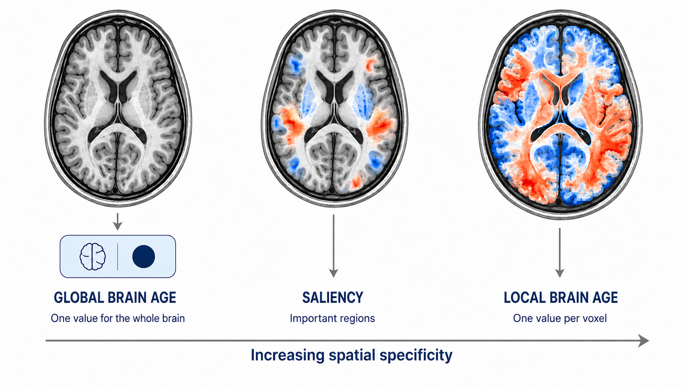

 

  <!-- Links with Badges -->
  
  

   

  <!-- Badges without Links -->
  
  
  
  

I develop AI-powered solutions for computer vision and medical imaging, specializing in explainable AI (XAI) and deep learning. My current work focuses on building interpretable models for neuroimaging and healthcare applications.

---

# About Me

- 🎓 PhD Candidate, University of Southern California 
- 🧠 8+ years of research experience spanning deep learning, computer vision, and medical imaging
- 📄 First-author publications in PNAS, GeroScience and other leading venues
- ☁️ Experience building ML pipelines on AWS, Linux GPU clusters, and NVIDIA A100 hardware
- 🔬 Interested in Generative AI, Computer Vision, Foundation Models, Medical AI, and Scientific Machine Learning

---

# Technical Skills

## Deep Learning & Generative AI: 
PyTorch, TensorFlow, CUDA, Diffusion Models, ControlNet, Transformers, Explainable AI

## MLOps & Infrastructure: 
Docker, AWS (EC2/S3), Linux GPU clusters (A100), GitHub Actions, Git

## Programming & Data: 
Python, C++, MATLAB, SQL, NumPy, pandas, Elasticsearch

---

# Featured Projects

## Stanford Cars Classification & Model Explainability

Developed an end-to-end PyTorch workflow for training a ResNet50 classifier on the 196-class Stanford Cars dataset. Implemented multiple explainable AI (xAI) tools to analyze fine-grained classification, comparing gradient-based methods (Vanilla Saliency, Grad-CAM, Guided Backprop, Integrated Gradients) with model-agnostic techniques (LIME, SHAP). Designed an interactive Streamlit application for real-time inference and dynamic saliency map visualization.

**Highlights**

- PyTorch & ResNet50 architecture
- Explainable AI (xAI) and feature attribution
- Saliency mapping (Grad-CAM, Integrated Gradients)
- Interactive Streamlit dashboard

🔗 [Live Demo](https://salientstanfordcars.streamlit.app/) | 🔗 [GitHub](https://github.com/nikhilcusc/StanfordCarDataset/)

**Impact:** Practical demonstration of how explainable AI techniques can enhance model interpretability. Aids researchers and practitioners in understanding model decisions in fine-grained image classification tasks.

---

## Personal AI Cloud: Secure Remote Access to Local LLM

- As everyday users (and enterprises) prioritize data privacy via local LLMs, accessing desktop hardware remotely remains a major friction point.
- Built a full-stack web application to securely query a locally hosted **Qwen-2.5B** model on my NVIDIA GTX 1050
 from any smartphone (or any internet connected device) anywhere in the world.
- Integrated **zrok2** for zero-trust network tunneling, implemented secure **user authentication**, and built a responsive UI for low-latency mobile interactions.
- End-to-end execution across machine learning infrastructure, network security, and product-driven web development.

**Tech:** Qwen-2.5B, zrok2, Local LLMs, Zero-Trust Tunneling, GPU Acceleration, Full-Stack Development, Authentication & Security, AI Infrastructure

Note: The credentials have been changed to prevent unauthorized usage. To access the demo, please contact me directly.
**[Live Demo / Contact for Access](#contact)**

**Impact:** This project demonstrates a practical solution for secure remote access to local LLMs. It enables everyday users of LLMs (including researchers and potentially enterprises) to leverage powerful AI models on the go while maintaining data privacy and security. It addresses a critical need in the AI community for accessible and secure model deployment.

---

## DICOM Anonymizer

- Open-source software for configurable DICOM de-identification with multiple anonymization levels.
- DICOMAnon is a tool for anonymizing medical DICOM images. It removes sensitive patient information.
- Uses a Vue/Electron frontend and a Python backend.
- Connects to an Orthanc PACS server. Users can retrieve, anonymize, and save DICOM images.

🔗 [GitHub](https://github.com/nikhilcusc/DICOMAnon)

**Impact:** This tool has the potential to be widely adopted in medical imaging research to ensure patient privacy while enabling data sharing. It supports compliance with HIPAA and other privacy regulations, facilitating collaborative research without compromising sensitive information.

---

# Research Experience

## Graduate Research Assistant
**Aging & Imaging Laboratory**
**University of Southern California**
2018 – Present

Progressed from developing neuroimaging pipelines and supporting research workflows to independently designing deep learning systems, leading medical AI projects, and managing GPU and cloud infrastructure.

### Early Research & Technical Foundation

- Developed diffusion MRI tractography pipelines for analyzing brain connectivity.
- Built reproducible neuroimaging and deep learning pipelines using PyTorch and TensorFlow.
- Evaluated explainable AI techniques, including Integrated Gradients and SHAP, for interpreting medical AI models.

### Deep Learning & Medical AI Development

- Developed deep learning models for biological brain age prediction from structural MRI.
- Built and patented automated CT brain segmentation software for regional brain morphometry.
- Designed ControlNet + diffusion models for longitudinal MRI synthesis and prediction.

### Research Infrastructure & Technical Ownership

- Managed cloud-based neuroimaging workflows using AWS EC2 and S3.
- Configured and maintained Linux GPU infrastructure, including NVIDIA A100 systems.
- Supported scalable experimentation and large-scale model training across research projects.

### Selected Projects

#### Global Brain Age Estimation

- Developed and released a TensorFlow-based deep learning model to estimate biological brain age from structural MRI.
- Produces a single, whole-brain age estimate, representing the overall biological age of the brain.
- Enables comparison between predicted brain age and chronological age to identify accelerated or delayed brain aging.
- Designed with an emphasis on generalizability across diverse populations.

**Tech:** TensorFlow, Python, Medical Imaging, MRI, Deep Learning

🔗 [GitHub](https://github.com/irimia-laboratory/USC_BA_estimator/tree/v2)

**Impact:** This model has been utilized in multiple research studies to investigate the relationship between brain aging and cognitive decline. It provides a valuable tool for early detection of neurodegenerative conditions.

#### Local Brain Age Prediction

Improved upon the global brain age prediction model by developing a deep learning–based local brain age estimation framework that predicts regional biological brain age from structural MRI, offering more interpretable and sensitive assessment of localized brain aging. A docker image was containerized and published to GHCR.

**Highlights**

- Autoencoder models
- MRI preprocessing
- Explainable AI
- Large-scale GPU training

🔗 [Demo](https://usclocalba.streamlit.app/) | 🔗 [GitHub](https://github.com/irimia-laboratory/USC_LBA_estimator/) | 🔗 [🐳 Docker](https://ghcr.io/nikhilcusc/localba:latest)  

**Impact:** This local brain age prediction model has been applied in research to identify early signs of neurodegeneration and cognitive decline. It has the potential to enable targeted interventions and personalized healthcare strategies.

--- 

## Undergraduate Research Assistant
**School of Computer Science and Engineering, VIT**  
2016 – 2017

Conducted interdisciplinary research spanning mobile sensing, cryptography, interactive simulations, and cybersecurity, with a focus on developing practical technology-driven solutions.

### Selected Project

#### Yoga Posture Prediction

Developed hardware and a custom Android application to track body vitals and predict beneficial yoga postures.

**Tech:** Android, Mobile Development, Sensors, Hardware

**Impact:** Demonstrated how mobile and wearable sensing could support personalized fitness and posture recommendations.

<!--

## Advanced Encryption Standard (AES)

Evaluated the performance of **AES encryption and decryption** across different numbers of encryption rounds.

**Tech:** AES, Cryptography, Performance Analysis

**Impact:** Provided insight into the trade-off between computational performance and encryption complexity.

## Chemistry Simulation (Eureka)

Developed simulations of chemical reactions at the atomic level using basic animations.

**Tech:** Java, Oracle 11g, Greenfoot

**Impact:** Created an interactive approach for visualizing chemical reactions and understanding atomic-level processes.

-->

<!--

## Fitness Tracking System

Developed a low-cost **Arduino-based pedometer** to track calorie expenditure, participant velocity, and distance traveled.

**Tech:** Arduino, Sensors, Embedded Systems

**Impact:** Demonstrated an affordable approach to collecting and monitoring basic fitness metrics using embedded hardware.
-->

<!--
## SQL Injection Detection and Prevention

Developed a demonstration of **SQL injection attacks (SQLIA)** and investigated techniques for their detection and prevention.

**Tech:** SQL, Database Security, Cybersecurity

**Impact:** Demonstrated common database vulnerabilities and practical approaches for improving application security.
-->

# Employment History

## Software Engineering Intern
**VirtusaPolaris**  
North Plainfield, New Jersey, USA  
2017

Developed a **Business Process Management (BPM)** application using Pega Rules Process Commander (PRPC).

### Selected Contributions

- Modeled and automated business processes using Pega PRPC.
- Developed workflows to execute and control business activities.
- Implemented functionality to measure and optimize business process flows.

**Tech:** Pega PRPC, BPM, Business Process Automation

**Impact:** Helped automate business workflows and improve the management of process-driven activities.

## Software Engineering Intern
**Persistent Systems**  
Nagpur, Maharashtra, India  
2014

Worked on data processing and analytics using Elasticsearch and Kibana.

### Selected Contributions

- Analyzed Twitter data to calculate user engagement.
- Built data transformations and aggregations using Elasticsearch.
- Used Kibana and JSON for data analysis and visualization.

**Tech:** Elasticsearch, Kibana, JSON, Data Analytics

**Impact:** Enabled structured analysis of social media engagement through scalable data aggregation and visualization.

---

# Publications

- 20+ peer-reviewed publications
- First-author papers in PNAS, GeroScience.
- IEEE ISBI, ICASSP, OHBM, AAIC

## Selected Publications

1. **Deep learning maps local brain aging in relation to cognition across human adulthood**  
   *Proceedings of the National Academy of Sciences (PNAS), 2026* [Paper 🔗](https://www.pnas.org/doi/10.1073/pnas.2532233123)

1. **Interpretable Deep Learning Reveals Spatiotemporal MRI Features of Brain Aging That Align with Neurodegeneration**  
*GeroScience, 2026*  [Paper 🔗](https://doi.org/10.1007/s11357-026-02112-2)

1. **Anatomic Interpretability in Neuroimage Deep Learning: Saliency Approaches for Typical Aging and Traumatic Brain Injury**  
   *Neuroinformatics, 2024*  [Paper 🔗](https://doi.org/10.1007/s12021-024-09694-2)

1. **Controllable Generative Model for Brain Evolution** (*Equal Contribution*)  
   *ICASSP 2025 – IEEE International Conference on Acoustics, Speech and Signal Processing*
   [Paper 🔗](https://doi.org/10.1109/ICASSP49660.2025.10888742)

📚 **View all publications:** [Google Scholar](https://scholar.google.com/citations?user=0HvizQ0AAAAJ&hl=en)

**Visit my ORCID** [ORCID](https://orcid.org/0000-0003-3048-6710)

---

# Downloads
<a href="assets/files/Resume.pdf" class="btn">Download Resume</a>

<a href="assets/files/CV.pdf" class="btn">Download CV</a>

---

# Contact

 

- Email: nikhilc [ at ] usc. edu

- Personal email: <a href="javascript:void(0)" class="btn" onclick="revealEmail()">Reveal personal email</a>

<noscript> Please enable JavaScript to view my email. </noscript>
- [LinkedIn](https://linkedin.com/in/nikhil-chaudhari95)
